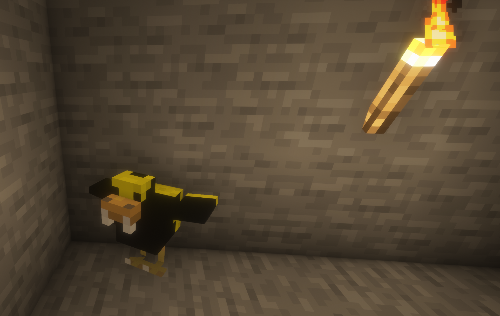

# CrimsonGold Mod

**Version:** 1.21.1  
**Loader:** NeoForge (21.1+)

A companion mod with the famous Mr. Fuchsky and Count Duckula.

## Screenshots

### Count Duckula



### Mr. Fuchsky


## Creatures

### Count Duckula

A night-spawning vampire duck who can be tamed and brings synergies to your team.

- **Favorite Food**: Pumpkin Pie (Use to tame).
- **Synergy**: When near a tamed Mr. Fuchsky, grants Regeneration to the owner.

### Mr. Fuchsky

An Italian fox of noble origin, originally known as "Il fino seniore Fuchsky".

- **Favorite Food**: Cookies (Use to tame).
- **Synergy**: When near a tamed Count Duckula, grants Regeneration to the owner.

## Important - Please Read!

**DO NOT SLAUGHTER THEM!**
It is considered extremely bad karma to kill these companions. If you do, you will be cursed with the **Wither** effect.

**How to dismiss them:**
If you need to part ways, do not kill them. Instead, give them a **Golden Carrot**. This will peacefully send them off.

## Build Command

To build the project, run:

```bash
gradle clean build
```
